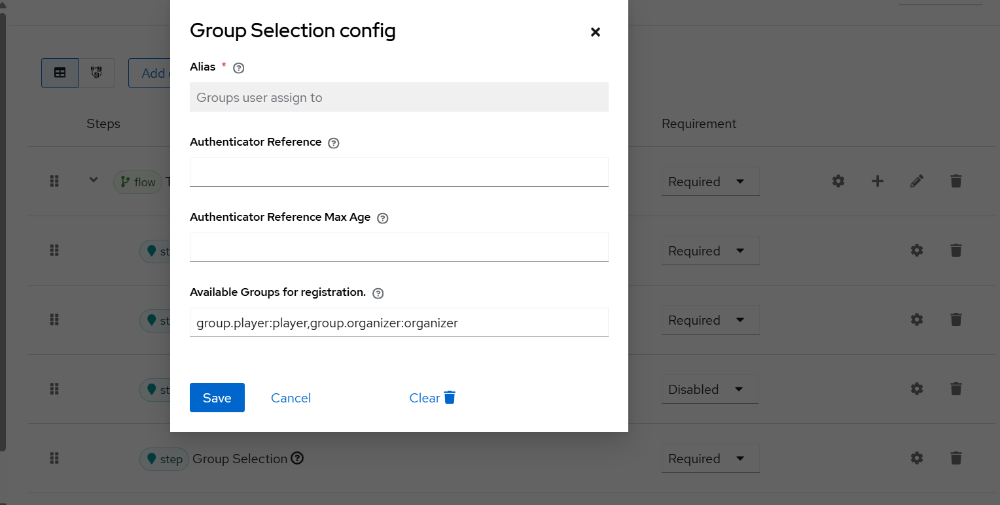
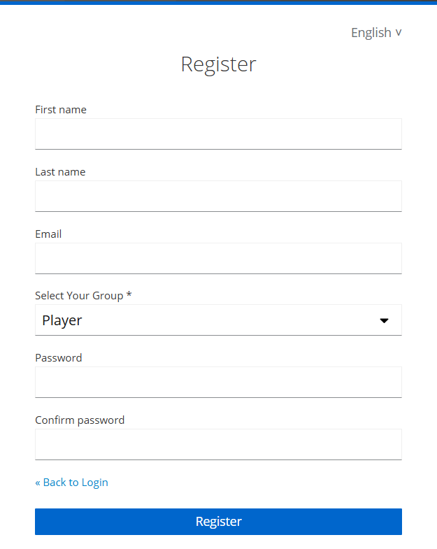

# Keycloak: Registered user to group
This is a Keycloak extension to assign an user to group during the registration process.

## What is it used for?
In many applications, users have the option of registering themselves. This raises the question of how users are 
then automatically assigned permissions. Groups are often used for this purpose, which are then assigned one or more roles. 
This extension offers the option of assigning a user to an existing group during the registration process.

## How does the extension work?
When this form action is used in a registration flow, the administrator can specify the groups that should
be displayed to the user during the registration process. The groups can be specified as a comma-separated list.
To ensure multilingualism, it is necessary to specify the groups in a special format. This is structured as follows: 
`translationKey1:groupName1` 

The `translationKey1` must be added to the message properties.
If the groups `customers` and `partners` exist, the following group name can be used, for example:
`group.customer:customers,group.partner:partners`.



The extension uses this group name and separates it with commas, creating a list of strings in the format 
`translationKey:groupName`. These entries are then separated by colons and collected in a map. 
This is added to the `LoginFormsProvider` as an attribute to make it available in the `registration.ftl` theme.

In the registration theme, for example, the following section can be added to enable a dropdown selection.
````
<#if groupMappings?? && groupMappings?size &gt; 0>
                <div class="${properties.kcFormGroupClass!}">
                    <div class="${properties.kcLabelWrapperClass!}">
                        <label for="user.attributes.selectedGroup" class="${properties.kcLabelClass!}">
                            ${msg("group.selection.label")} *
                        </label>
                    </div>
                    <div class="${properties.kcInputWrapperClass!}">
                        <select id="user.attributes.selectedGroup"
                                name="user.attributes.selectedGroup"
                                class="${properties.kcInputClass!}"
                                aria-invalid="<#if messagesPerField.existsError('user.attributes.selectedGroup')>true</#if>">
                            <#list groupMappings as translationKey, groupName>
                                <option value="${groupName}"
                                        <#if (register.formData['user.attributes.selectedGroup']!'') == groupName>selected</#if>>
                                    ${msg(translationKey)}
                                </option>
                            </#list>
                        </select>
                        <#if messagesPerField.existsError('user.attributes.selectedGroup')>
                            <span id="input-error-group" class="${properties.kcInputErrorMessageClass!}" aria-live="polite">
                                ${kcSanitize(messagesPerField.get('user.attributes.selectedGroup'))?no_esc}
                            </span>
                        </#if>
                    </div>
                </div>
            </#if>
````


This will result in this example registration page:



The extension requires that only the `groupName` and not the `translationKey` is used during registration.
After the user registers, the system checks whether a `groupName` has been selected and the `groupName`
exists in the configured group name mappings. If not, an error is thrown.

If successful and the group exists in Keycloak, the user is assigned to the related group.

## Build
To build the project you can run:

```shell
mvn clean verify
```

## Integration Tests
If you have docker installed, you can execute the integration tests with: 

```shell
mvn clean verify failsafe:integration-test failsafe:verify
```